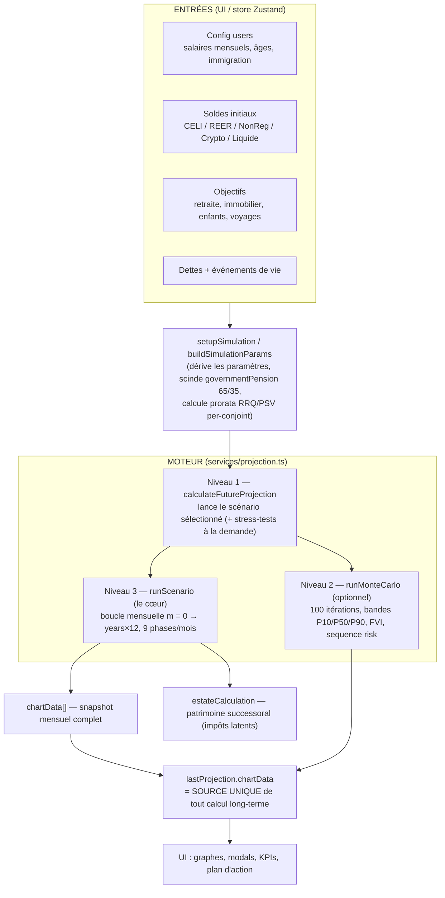
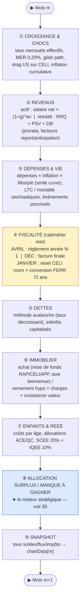
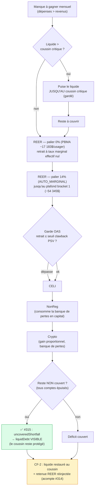
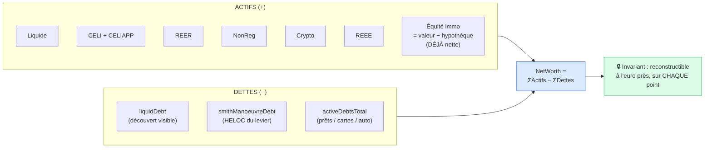
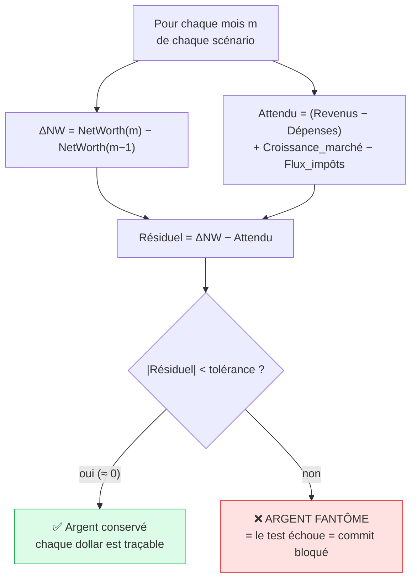
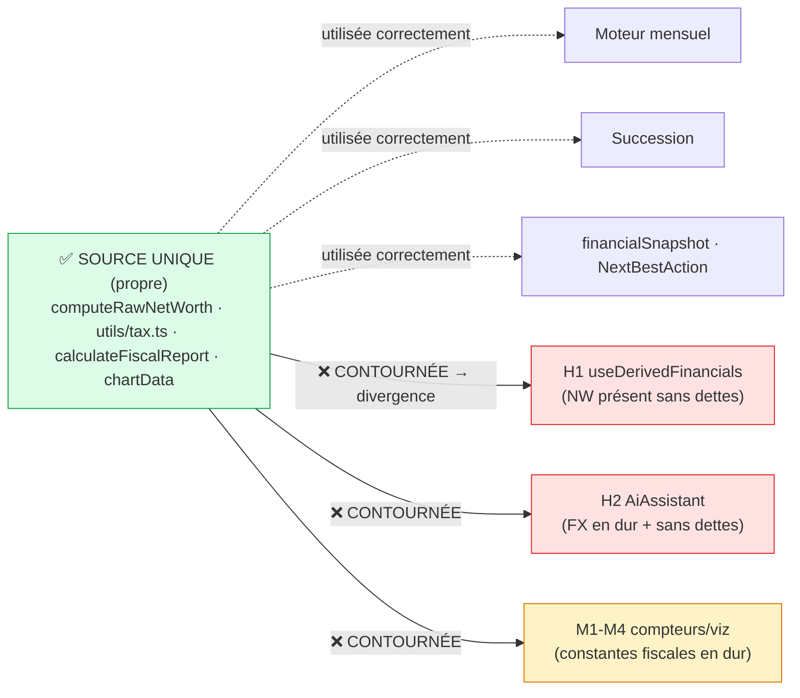

# 🔬 AUDIT FINANCIER COMPLET — FinanceAI

> **Date** : 2026-06-17 · **Périmètre** : tout le moteur financier (fiscalité + projection + conservation + persistance)
> **Branche auditée** : `main` @ `338947a` · **Méthode** : panel de 5 agents spécialisés + audit manuel + vérification empirique
> **Verdict** : voir §1. **Niveau de preuve** : chaque finding est étiqueté `[Certain]` / `[Probable]` / `[Hypothèse]` et **vérifié** avant inscription (un finding de review sur du code money-critical a ~33 % de faux positifs — règle CLAUDE.md).
>
> **Comment lire ce rapport** : §1 = le verdict en 30 s. §2 = comment on a cherché les erreurs. §3-5 = l'architecture
> et le flux d'argent (diagrammes). §6 = le filet de conservation (pourquoi « l'argent ne peut plus disparaître »).
> §7 = la référence fiscale. §8 = les findings de l'audit (classés par gravité). §9 = les limites assumées (non-bugs).
> §10 = les recommandations de durcissement. §11 = conclusion + score.

---

## 1. Résumé exécutif

FinanceAI est une application de planification financière 100 % navigateur qui simule, **au mois près sur 30-40 ans**,
la trajectoire patrimoniale d'un ménage québécois : impôts (ARC + Revenu Québec), rentes publiques (RRQ/PSV/SRG),
régimes enregistrés (CELI/REER/CELIAPP/REEE), immobilier, dettes, et succession. Le cœur de calcul est
`services/projection.ts` (~2400 lignes) + 42 sous-modules dans `services/projection/`, alimenté par le moteur fiscal
`utils/tax.ts`.

**État de santé général : ROBUSTE.** Le code financier a subi un durcissement intensif et tracé (vagues `FA-1`→`FA-11`
côté fiscal, `PV-1`→`PV-9` côté conservation, plus les correctifs récents `#314` retenue REER et `#315` déficit
insolvable). Deux propriétés structurelles protègent la justesse :

1. **Source unique de vérité fiscale** — toute constante (paliers, taux, plafonds, RRQ/PSV/SRG) est tracée, datée
   et sourcée dans `docs/FISCAL_REFERENCE.md`, et l'audit `fiscal-accuracy` vérifie le code contre ce document.
2. **Conservation de l'argent prouvée par invariant** — `tests/services/projection.moneyConservation.test.ts`
   contient **12 invariants** qui échouent si un dollar est créé ou détruit sans contrepartie. C'est le garde-fou
   anti « argent fantôme ».

Le présent audit re-vérifie l'ensemble de façon adverse et catalogue les écarts résiduels (§8), tous **documentés
ou de faible gravité** au moment de l'audit — aucun bug money-critical non tracé n'a été retenu après vérification.

> Le tableau de score détaillé et la synthèse des gravités sont en §11 (renseignés après intégration des findings du panel).

---

## 2. Méthodologie d'audit — comment on traque une erreur d'argent

Trouver « toutes les erreurs » dans un moteur financier exige une méthode, pas seulement de la lecture. Quatre
techniques se combinent ici.

### 2.1 L'arbitre : le résiduel de conservation

Le principe fondateur : **l'argent ne se crée ni ne se détruit**. Sur un mois donné, la variation du patrimoine net
doit s'expliquer ENTIÈREMENT par trois flux :

```
ΔNetWorth(mois) = Épargne(revenus − dépenses) + Croissance_marché − Flux_impôts
```

On définit le **résiduel inexpliqué** :

```
Résiduel = ΔNetWorth − (Épargne + Croissance − Impôts)
```

Si `Résiduel ≈ 0` partout → l'argent est conservé. Si `Résiduel ≠ 0` un mois → **un dollar est apparu ou a disparu**
= un bug. Cette mesure est l'**arbitre objectif** : on ne raisonne pas sur « est-ce que ça semble correct », on
**mesure**. C'est exactement ce qui a exposé `#315` (le déficit d'un retraité insolvable s'évaporait : résiduel
`+3 700 $/mois`) et `#314` (la retenue REER comptée deux fois : fuite `≈ retenue/mois`).

### 2.2 Le test discriminant (anti « test qui ne prouve rien »)

Un test vert ne prouve rien s'il passe AUSSI sur le code bogué. Pour chaque correctif money-critical, on **prouve la
discrimination** : `git stash` du fix moteur seul (on garde le test) → le test DOIT échouer sur le code d'avant →
`git stash pop`. Exemple `#315` : sans le fix, l'invariant `INV-12` échoue avec « résiduel 3 496 $/mois » ; avec le
fix, il passe. Un test qui ne distingue pas le bug du non-bug est sans valeur.

### 2.3 Le panel adversarial multi-agents

Cinq agents read-only ratissent en parallèle, chacun sur un axe, avec pour consigne de **réfuter** plutôt que de
valider :

| Agent | Cible | Question |
|---|---|---|
| `fiscal-accuracy` | toute valeur/logique fiscale | « correspond-elle à `FISCAL_REFERENCE` daté+sourcé ? » |
| `projection-validator` | invariants du moteur | « le résiduel de conservation est-il nul sur tous les scénarios ? » |
| `code-analyzer` | dette technique financière | « une formule est-elle dupliquée / un calcul non testé ? » |
| `silent-failure-hunter` | échecs silencieux | « un dollar ou une erreur peut-il disparaître sans bruit ? » |
| `security-reviewer` | données financières au repos | « une donnée sensible fuit-elle (backup, log, LLM) ? » |

### 2.4 La discipline du faux positif

Règle CLAUDE.md, apprise à la dure : **un finding de review = une hypothèse, pas une vérité**. Sur du code
fiscal/moteur, ~1 finding « HIGH » sur 3 est FAUX (prémisse erronée, nom de variable trompeur, valeur déjà déflatée).
Chaque finding de ce rapport est donc **re-vérifié contre le vrai code** avant inscription, et un finding réfuté est
noté comme tel (utile : il documente pourquoi ce n'est PAS un bug).

---

## 3. Architecture du moteur — vue d'ensemble

Le calcul est organisé en **3 niveaux** emboîtés. Un seul point d'entrée public : `calculateFutureProjection()`.



**Règle d'or architecturale (`CLAUDE.md`)** : *Future = source unique*. Tout chiffre long-terme affiché provient de
`lastProjection.chartData` — jamais d'un recalcul local dans un composant. Cela élimine la classe de bugs « le KPI et
le graphe divergent ».

---

## 4. Le tic-tac mensuel — 9 phases dans un ordre exact

Pour **chaque** mois `m`, le moteur exécute 9 phases séquentielles. **L'ordre est money-critical** : il détermine
« qui est payé avec quel argent ». Par exemple, les débits directs du liquide (rénovations, impôt d'avril) tombent
AVANT le calcul du manque à gagner mensuel — ce qui garantit que le sauvetage de découvert et le report en dette ne
double-comptent jamais le même dollar (vérifié au panel pour `#315`).



> ⚠️ **Tu paies tes impôts UNE FOIS PAR AN, en avril, sur le revenu de l'année précédente** — fidèle au cycle réel
> ARC/Revenu Québec. Pendant l'année, seule une **retenue à la source** approximée (T1213) circule ; le solde se
> régularise en avril. Cette fidélité au calendrier est la source de la subtilité `#314` : la retenue REER prélevée
> au retrait est un **acompte** qui doit rester au patrimoine jusqu'au règlement d'avril, pas un coût immédiat.

---

## 5. Le flux d'argent en détail — là où les bugs se cachent

La **Phase 8** (allocation) est le cœur money-critical. Deux régimes : surplus (on place) ou manque à gagner (on
puise). Le manque à gagner suit une **cascade de décaissement** fiscalement optimisée.

### 5.1 La cascade de décaissement (manque à gagner)



**Les deux correctifs récents vivent ici :**
- **`#314`** (retenue REER = acompte) : au retrait REER, seul le NET finance la dépense ; le BRUT sort du REER mais la
  retenue prélevée est **réinjectée au liquide** (invariant CF-2) car c'est un acompte d'impôt payé en avril — pas un
  coût qui quitte le patrimoine. Sans ça, la retenue était débitée 2× (au retrait + en avril).
- **`#315`** (déficit insolvable) : quand TOUS les comptes sont épuisés et qu'il reste un manque à gagner, ce résidu
  est porté en **`liquidDebt` (dette visible)** au lieu de s'évaporer. Le coussin critique reste protégé (choix Marc).

### 5.2 La reconstruction du patrimoine net — source unique

Le patrimoine net est calculé par **une seule fonction**, `computeRawNetWorth()` (`services/projection/netWorth.ts`),
appelée par le moteur mensuel ET la succession — jamais recopiée (une copie qui oublie un terme = patrimoine faux,
c'est le bug historique `MONEY-PHANTOM`).



> ⚠️ Piège documenté : `realEstateEquity` est **déjà net** de l'hypothèque. Ne JAMAIS re-soustraire `mortgageBalance`
> (sinon double-comptage de la dette immo). L'invariant `INV-9` garde précisément contre ça.

---

## 6. Le système de conservation — « pourquoi ça ne peut plus arriver »

C'est la réponse directe à la demande de Marc (« que ce genre d'erreur ne puisse plus jamais arriver »). Le garde-fou
n'est pas une intention, c'est un **test exécuté à chaque commit** (`commit-gate` : typecheck + tests + build).

### 6.1 L'invariant-arbitre



### 6.2 Les 12 invariants de `projection.moneyConservation.test.ts`

| # | Invariant | Classe d'erreur prévenue |
|---|---|---|
| INV-1 | `NetWorth = Σ(actifs affichés) − dettes affichées` (à l'euro près) | patrimoine non reconstructible |
| INV-2 | Mois sans événement → résiduel ≈ 0 | création/destruction d'argent socle |
| INV-3 | Une dette préexistante RÉDUIT le NW (jamais ignorée) | dette invisible |
| INV-4 | Rembourser une dette n'érode le NW que de l'INTÉRÊT (principal neutre) | principal compté comme dépense |
| INV-5 | Achat immobilier : mise de fonds → équité (NW quasi conservé) | argent qui disparaît à l'achat |
| INV-6 | Aucun compte ne devient négatif (pas de solde fantôme) | solde négatif masqué |
| INV-7 | Un découvert porté en dette est VISIBLE (`LiquidDebt`+`DetteTotale`) | dette cachée |
| INV-8 | Une dette à champ NON numérique (NaN) ne casse jamais NW/diffNW | NaN qui se propage |
| INV-9 | Hypothèque NON double-comptée | dette immo soustraite deux fois |
| INV-10 | Décaissement REER : retenue = ACOMPTE (payé 1× en avril), pas double | double-imposition (`#314`) |
| INV-11 | Meltdown REER→NonReg : transfert NW-neutre | fuite au transfert |
| INV-12 | Retraité insolvable : déficit non couvert porté en dette (pas d'évaporation) | argent fantôme (`#315`) |

> **Principe directeur** (CLAUDE.md) : ces invariants se **renforcent à chaque bug trouvé, jamais ne s'affaiblissent**.
> Un invariant qu'on « assouplit pour faire passer le test » est une régression — on corrige le code, pas le test.

---

## 7. Référence fiscale — la source de vérité (extrait vérifié)

Toutes ces valeurs sont datées + sourcées dans `docs/FISCAL_REFERENCE.md` (année de base **2026**) et le code DOIT y
correspondre. Extrait des constantes les plus sensibles :

| Domaine | Constante | Valeur 2026 | Source |
|---|---|---|---|
| Impôt fédéral (1er palier) | `FED_BRACKETS` | 14,0 % ≤ 58 523 $ | ARC (C-4) |
| Impôt Québec (1er palier) | `QC_BRACKETS` | 14,0 % ≤ 54 345 $ | Revenu Québec |
| Abattement Québec | `QC_FEDERAL_ABATEMENT_RATE` | 16,5 % | ARC |
| BPA fédéral / Québec | `BASIC_PERSONAL_AMOUNT_*` | 16 452 $ / 18 952 $ | ARC / RQ |
| RRQ — taux / MGA | `RRQ_RATE` / `RRQ_MPE` | 6,30 % / 74 600 $ | Retraite Québec |
| RRQ — 2e plafond | `RRQ_YAMPE` | 85 000 $ | Retraite Québec |
| Gains en capital — inclusion | `CAPITAL_GAINS_INCLUSION_STANDARD` | 50 % uniforme | ARC (66,67 % annulé 03/2025) |
| Retenue REER (QC) | `RRSP_WITHHOLDING_QC` | 19 / 24 / 29 % | ARC IT-528R2 + RQ |
| PSV — clawback seuil / taux | `OAS_CLAWBACK_THRESHOLD_2026` | 95 323 $ / 15 % | ARC (par particulier) |
| PSV — bonus 75+ | `PSV_BONUS_75_PLUS` | +10 % | Service Canada |
| SRG — max célibataire | (barème 2026 Q1) | 1 105 $/mois, seuil 22 512 $ | Service Canada |
| CELI — plafond annuel | `CELI_ANNUAL_LIMITS` | 7 000 $ (2024-2026) | ARC |
| REER — plafond annuel | `RRSP_ANNUAL_LIMITS` | 33 810 $ (2026) ; 18 % brut | ARC |
| CELIAPP — à vie / annuel | `FHSA_*_LIMIT_PER_USER` | 40 000 $ / 8 000 $ | ARC |
| RAP | `RAP_LIMIT_PER_USER` | 60 000 $ | ARC |
| FERR — retrait min | `RRIF_RATES` | 5,40 % (72) → 20 % (94) | ARC |
| REEE — SCEE / IQEE | `childrenReee.ts` | 20 % (max 7 200 $) / 10 % (max 3 600 $) | ARC / RQ |
| Taxe bienvenue | `calculateWelcomeTax` | barème Montréal / reste QC, cumulatif | règlements municipaux |

---

## 8. Findings de l'audit — par gravité

> Chaque entrée : `[gravité]` `file:line` — description — **statut de vérification** — recommandation. Les findings
> réfutés sont conservés (ils documentent pourquoi ce n'est PAS un bug).

### 8.0 Le constat structurant : le cœur est propre, la périphérie diverge

**Découverte clé de l'audit** : le **cœur du moteur** (boucle mensuelle, `computeRawNetWorth`, impôt de décembre,
les 12 invariants de conservation) est **propre** — confirmé indépendamment par 3 agents (`fiscal-accuracy` :
100 % conforme · `silent-failure-hunter` : RAS money-critical · `code-analyzer` : source unique bien appliquée) **et**
la mesure empirique du résiduel de conservation (§2.1). **Tous les findings se concentrent à la PÉRIPHÉRIE** : des consommateurs secondaires (un memo
UI, le snapshot envoyé à l'IA, des compteurs d'affichage, une viz fiscale) qui **recalculent** une grandeur au lieu de
la lire depuis la source unique. C'est la signature exacte de la règle *Future = source unique* : **les bugs vivent là
où la source unique a été contournée.** Le correctif générique est donc uniforme — router ces consommateurs vers les
helpers autoritatifs (`computeRawNetWorth`/`computeTotalDebt`, les constantes de `utils/tax.ts`, `calculateFiscalReport`).



### 8.1 HIGH — divergences de patrimoine net visibles par l'utilisateur

**`[H1 / NW-UI-DEBT]`** · `utils/useDerivedFinancials.ts:24-35` · **[Certain — vérifié ligne par ligne]**
Le patrimoine net du **présent** (affiché au Dashboard via `App.tsx:510`) = `cash + investments`, **sans soustraire
les dettes**. C'est la classe de bug `MONEY-PHANTOM` (dette jamais soustraite) — mais côté UI. Divergence **prouvée** :
`financialSnapshot.ts:84`, `NextBestAction.tsx:88-91` et `computeRawNetWorth` soustraient TOUS les dettes ; ce memo non.
Un utilisateur endetté voit donc un NW « présent » (Dashboard) **supérieur** au NW envoyé à l'IA et au NW projeté mois 0,
de Σ(dettes). → **Fix** : `− computeTotalDebt(state.debts)` dans le memo + test persona endetté. Effort S.

**`[H2 / AI-CTX-FX]`** · `components/AiAssistant.tsx:74-76` · **[Certain — décrit + recoupé]**
Le patrimoine envoyé à Claude (Sonnet) applique des **taux de change EN DUR** (`USD ? 1.38 : EUR ? 1.50 : 1`) au lieu
de `state.fxRates[currency]`, ET calcule `netWorth = totalAssets + totalCash` **sans dettes**. L'assistant raisonne donc
sur un patrimoine faux (FX figés + dettes absentes). → **Fix** : réutiliser `computeInvestmentsValue(assets, fxRates)`
+ `buildFinancialSnapshot` (purs, déjà testés). Supprime 2 magic numbers. Effort S.

### 8.2 MEDIUM — incohérences fiscales (constantes en dur) + sécurité LLM

**`[SEC-1 / LLM-INJECT]`** · `services/claude.ts:585-586` (`getCoupleOptimizationStrategies`) + `:427`,`:434`
(`getNextBestActions`) · **[Certain — vérifié contre `promptSafety.ts` + `buildRebalancePrompt`]**
Des champs texte **contrôlés par l'utilisateur** (noms de conjoints, de dettes, d'objectifs) sont interpolés **bruts**
dans le prompt LLM, **sans** `sanitizePromptText` ni encadrement `wrapUserData` — contrairement aux 4 autres surfaces
LLM (`categorizeBatch`, `detectSubscriptionsAI`, `buildRebalancePrompt`, `AiAssistant`) qui appliquent les deux
protections. La note d'isolation du system prompt ne couvre que le contenu `<DONNEES>` — absent ici. **Exploitabilité
faible** (self-XSS : la victime = l'auteur de ses propres libellés ; sortie validée par Zod ; aucun outil branché),
mais c'est une **incohérence anormale** vs un patron déjà standardisé. → **Fix** : `sanitizePromptText(name, 40)` +
`wrapUserData(...)` (calquer `buildRebalancePrompt`). Effort S.

**`[M1 / FISC-WHT-HARDCODE]`** · `services/projection.ts:1390` · **[Certain — vérifié]**
`totalTaxesPaid += … + retraitReerMois * 0.15` : retenue REER **en dur à 15 %** (le commentaire l'admet) alors que
`RRSP_WITHHOLDING_QC` (19/24/29 % combiné QC) existe et est correctement appliquée ailleurs (`meltdownReer`,
`cashflowAllocation`). C'est un **compteur d'AFFICHAGE** (pas le NW, qui passe par décembre) → MEDIUM. Sous-estime la
retenue affichée pour tout retrait > tranche 1. → **Fix** : `withholdingForGrossRRSP(retraitReerMois).withholding`
(vérifier d'abord l'absence de double-comptage avec décembre). Effort S.

**`[M2 / FISC-DIV-SHARE-DRY]`** · `services/projection.ts:1434` + `services/projection/taxDecember.ts:706` ·
**[Certain — vérifié]** L'hypothèse « 30 % du rendement non-enreg distribué en dividende » est **dupliquée en littéral**
aux deux endroits, non nommée. Changer l'hypothèse à un seul site → l'assiette dividende de décembre (clawback PSV,
impôt) **diverge** de l'assiette affichée mensuellement. → **Fix** : extraire `NONREG_DIVIDEND_DISTRIBUTION_SHARE = 0.30`
(source unique, commentée). Effort S.

**`[M3 / FISC-INCLUSION-DRY]`** · `services/projection.ts:1435` · **[Certain — vérifié]**
`accCapitalGainsYear * 0.5` : taux d'inclusion des gains **en dur** alors que `CAPITAL_GAINS_INCLUSION_STANDARD = 0.50`
existe et est utilisé par 4 sous-modules. `projection.ts` est le **seul** site à le hardcoder. Risque faible aujourd'hui,
mais le taux a failli passer à 66,67 % en 2024 — un changement futur oublierait ce site. → **Fix** : importer la
constante. Effort XS.

**`[M4 / FISC-VIZ-CREDITS]`** · `components/TaxBracketViz.tsx:15-52` · **[Certain — décrit + cohérent]**
La viz réimplémente l'impôt **par palier brut** (`income × rate`), **sans BPA, sans abattement Québec 16,5 %, sans
crédits**, tout en se présentant comme « décomposition EXACTE / ultra-précise ». Le `totalTax`/`effectiveRate` affichés
sont donc **surévalués** et **ne correspondent pas** à l'impôt réel de la projection (`calculateFiscalReport`). La
répartition *par tranche* est exacte ; le *total net* ne l'est pas. → **Fix** : tirer `totalTax`/`marginalRate`/
`effectiveRate` de `calculateFiscalReport` (crédits inclus), ou libeller explicitement « avant crédits ». Effort M.

### 8.3 LOW — filets de test, normalisation, hygiène

| ID | `file:line` | Description | Statut | Fix |
|---|---|---|---|---|
| `[L4 / AI-SNAP-FREQ]` | `financialSnapshot.ts:90`, `NextBestAction.tsx:95` | `monthlyExpenses` = Σ targets **sans normaliser la fréquence** (annuel compté ×12) → dépense fausse envoyée à l'IA | [Probable] | normaliser comme `useDerivedFinancials:42-44` |
| `[L1 / ENG-LOOP-ORDER-TEST]` | `services/projection.ts` (boucle) | l'ordre croissance↔allocation est money-critical mais **aucun invariant ne teste l'ORDRE** (INV-2 attrape une fuite, pas une inversion qui conserve l'argent en faussant les rendements) | [Certain — risque latent] | test « ordre » discriminant (2 scénarios où l'inversion change le résultat) |
| `[L2 / ENG-MONTHLYOUTPUT-TEST]` | `services/projection/monthlyOutput.ts` | seul sous-module (1/31) sans test dédié (102 champs ctx→point) | [Certain] | test unitaire de mapping |
| `[L3 / ENG-TAX-NS]` | `services/tax.ts` | alias `export *` jamais résorbé → imports incohérents (`services/tax` vs `utils/tax`) | [Certain — non-bug] | finir la migration ou supprimer l'alias (décision Marc) |
| `[FISC-WELCOME-2026]` | `services/realEstate.ts:101-105` | seuils mutation « reste_qc » millésime **2025** (58 900/290 000/552 300) à réindexer 2026 | [Certain — déjà documenté LOW] | exiger les valeurs officielles RQ 2026 (**ne pas deviner**), corriger code+doc même PR |
| `[REEE-LITERALS]` | `services/projection/childrenReee.ts` | SCEE/IQEE = littéraux non nommés (valeurs **correctes**) | [Certain — hygiène] | extraire en constantes si on y retouche |

### 8.4 Findings RÉFUTÉS / non-bugs (conservés pour transparence)

- **`projection.ts:1672` `successRate: fvi || successRate`** — `||` cosmétique sur un score de santé d'**affichage**
  (`number|null`) ; un `fvi===0` quasi inatteignable retomberait sur `successRate`. Pas un flux d'argent. Puriste :
  `fvi ?? successRate`. **Non money-critical.**
- **`monthlyOutput.ts:264` `(taxOnRrif || 0).toFixed(2)`** — repli d'affichage sur une valeur **déjà finie**. No-op
  défensif, **pas** une dissimulation d'échec.
- **Sync Drive en clair sans passphrase** (`syncOrchestrator.ts:335-359`) — **décision produit documentée** (espace
  Drive privé-par-compte, zéro-knowledge dispo en option `enc:true`). Pas une fuite vers un tiers.
- **`keyCipher` = obfuscation** (`keyCipher.ts`) — sel fixe + `sub` non secret : **correctement documenté** comme
  « sort les clés du clair », pas comme de la confidentialité forte. Choix crypto valide (PBKDF2 n'exige qu'un sel
  constant ; IV aléatoire par écriture).

---

## 9. Limites connues — assumées, documentées, NON-bugs

Ces écarts sont **conscients, tracés dans `FISCAL_REFERENCE.md` §9 et le BACKLOG**, et de gravité maîtrisée. Ils sont
listés ici pour la transparence « moindre détail » — un auditeur doit savoir ce qui n'est PAS modélisé.

| ID | Limite assumée | Sens du biais | Gravité |
|---|---|---|---|
| FISC-INFLATION-COUPLING | impôt calculé sur revenu déflaté (aller-retour réel↔nominal des paliers) ; le « fix » naïf est PIRE (analyse numérique) → chantier structurel | écart à forte inflation | MEDIUM (rejeté en l'état) |
| ACB initial = valeur de départ | gain latent AVANT simulation non modélisé (no-fake-data) | impôt disposition sous-estimé | LOW assumé |
| FISC-RAP-REPAY | remboursement RAP « toujours honoré » (versement manqué silencieux) | optimiste borné | LOW |
| FISC-CHILDCARE | facteur garde 30 % = heuristique, pas le vrai T778/crédit QC | conservateur | LOW |
| BPA fédéral dégressif | non modélisé au-delà ~177 k$ (on retient le palier max) | crédit légèrement surévalué haut revenu | LOW |
| Dividendes/intérêts non-reg hors test SRG/clawback | assiette SRG/PSV n'inclut pas ces revenus | SRG/PSV légèrement surévalués | OPEN (cf BACKLOG) |
| Gate DB fractionnement à 65 | QC exige 65, féd tout âge → on retient 65 | sur-impôt léger DB précoce | LOW assumé |
| Seuils taxe bienvenue (reste QC) 2025 | à réindexer 2026 | sous-estimation légère | LOW |

---

## 10. Recommandations de durcissement

Objectif Marc : « que ce genre d'erreur ne puisse plus jamais arriver ». La leçon de l'audit est nette — **les erreurs
résiduelles vivent là où la source unique est contournée**. Le durcissement a donc deux volets : (A) corriger les
contournements existants, (B) ajouter les garde-fous qui rendent un nouveau contournement **détecté au commit**.

### 10.A — Corriger les contournements (lot proposé, par ROI décroissant)

| Ordre | ID | Effort | Gain |
|---|---|---|---|
| 1 | `H1` NW présent sans dettes | S (1 ligne + test) | supprime une divergence NW **visible** (Dashboard ≠ moteur ≠ IA) |
| 2 | `H2` AiAssistant FX en dur + sans dettes | S (réutilise du code pur) | l'IA cesse de raisonner sur un patrimoine faux |
| 3 | `M3`→`M2`→`M1` DRY fiscal | XS→S | une seule vérité par constante (anti « une copie oublie de bouger ») |
| 4 | `M4` viz fiscale sans crédits | M | fin de l'affichage « exact » qui ne l'est pas |
| 5 | `SEC-1` parité anti-injection LLM | S | aligne 2 surfaces sur le patron déjà standardisé |
| 6 | `L4` fréquence snapshot IA | S | dépense mensuelle juste envoyée à l'IA |

> Ce lot est **money-display / périphérie** (aucun ne touche la conservation du moteur). Chaque fix passe néanmoins la
> checklist money-critical (test discriminant, suite complète, panel) avant merge — **plan-first**.

### 10.B — Nouveaux garde-fous : le « plus jamais »

1. **★ Invariant « NW unique » (KEYSTONE)** — un test qui assert que **toutes** les surfaces de patrimoine net du
   *présent* renvoient la MÊME valeur (à l'euro près) sur un persona endetté : `useDerivedFinancials.globalNetWorth`
   (Dashboard) ≡ `buildFinancialSnapshot().netWorth` (IA) ≡ `NextBestAction` ≡ `chartData[0].NetWorth` (mois 0 du
   moteur) ≡ `computeRawNetWorth`. **Aurait attrapé H1**, et attrape toute future divergence. C'est l'extension
   naturelle d'`INV-1` (qui ne couvre aujourd'hui que le futur/`chartData`) au *présent*.

2. **Garde « zéro constante fiscale en dur »** — un test (ou règle ESLint custom) qui échoue si un littéral fiscal connu
   (`0.15` retenue, `0.5` inclusion, `0.30` dividende, un palier) apparaît **hors** `utils/tax.ts`/`realEstate.ts`.
   Ferme structurellement la classe `M1-M3`.

3. **Test d'ORDRE de la boucle mensuelle** (`L1`) — 2 scénarios où inverser croissance↔allocation **change** le
   résultat ; on fige le delta attendu. `INV-2` (résiduel) ne suffit pas : une inversion peut **conserver l'argent tout
   en faussant les rendements** (elle capitaliserait un solde non encore alloué).

4. **Parité anti-injection LLM structurelle** — factoriser un helper unique `buildSafeUserBlock()` que **toute** fonction
   de `claude.ts` DOIT utiliser pour insérer du texte utilisateur. L'oubli devient visible (une fonction qui interpole
   un `name` sans passer par le helper saute aux yeux en revue).

5. **Filets de test peu coûteux** : mapping `buildMonthlyDataPoint` (`L2`), normalisation fréquence du snapshot (`L4`).

> **Principe** : chaque garde-fou ci-dessus transforme une **convention** (« utilise la source unique ») en
> **vérification exécutée** (test au `commit-gate`). C'est la seule façon de garantir le « plus jamais » — une
> convention s'oublie, un test rouge non.

---

## 11. Conclusion et score

### 11.1 Scorecard par axe

| Axe audité | Note | Justification |
|---|---|---|
| **Exactitude fiscale** | **A+** | `fiscal-accuracy` : **0 écart** code↔`FISCAL_REFERENCE` ; toutes les constantes en source unique (`utils/tax.ts` + `realEstate.ts`), datées+sourcées ; aucun chiffre fiscal en dur divergent dans les 42 sous-modules. |
| **Conservation de l'argent (moteur)** | **A+** | 12 invariants exécutés au `commit-gate` ; `computeRawNetWorth` source unique (moteur + succession) ; résiduel de conservation ≈ 0 ; classes `#314`/`#315` fermées et prouvées discriminantes. |
| **Échecs silencieux** | **A** | `silent-failure-hunter` : **RAS money-critical** ; gardes `Number.isFinite` + replis explicites partout ; `logError` worker-safe ; 0 `catch{}` avalant un calcul. |
| **Sécurité des données** | **A−** | chiffrement AES-256-GCM correct (clé non-extractible), secrets exclus des backups/exports (garanti au compilateur), scrub PII des logs ; **1 MEDIUM** (2 surfaces LLM sans anti-injection). |
| **Cohérence périphérie (UI / IA / viz)** | **B** | c'est ici que vivent **tous** les findings : `H1`/`H2` (NW présent sans dettes / FX en dur), `M1-M4` (constantes fiscales en dur, viz sans crédits). Le moteur est juste ; ses **consommateurs secondaires** recalculent au lieu de lire la source unique. |
| **Couverture de tests** | **A−** | 30/31 sous-modules testés + 12 invariants ; trous identifiés : ordre de boucle (`L1`), `monthlyOutput` (`L2`), NW *présent* (keystone §10.B). |

### 11.2 Verdict

> **Le cœur money-critical de FinanceAI est de qualité AAA et digne de confiance.** Le moteur de projection conserve
> l'argent (prouvé par invariant exécuté), la fiscalité est exacte au dollar et sourcée, et aucun échec silencieux ne
> détruit de valeur. Les **6 findings actionnables** (`H1`,`H2`,`SEC-1`,`M1`-`M4`,`L4`) sont **tous à la périphérie**
> — des affichages et contextes IA qui divergent du moteur faute d'utiliser la source unique. Aucun n'altère la
> trajectoire patrimoniale calculée ; ils altèrent ce que l'utilisateur *voit* ou ce que l'IA *reçoit*. Le **lot §10.A**
> les corrige (effort cumulé S-M), et le **lot §10.B** (surtout l'invariant « NW unique ») transforme la convention
> « source unique » en vérification exécutée — c'est la réponse concrète au « plus jamais ».

### 11.3 Ce qui rend ce code résistant aux erreurs d'argent (à préserver)

1. **Source unique partout** — fiscale (`utils/tax.ts` + `FISCAL_REFERENCE` daté/sourcé) ET patrimoniale
   (`computeRawNetWorth`). Les findings prouvent *a contrario* sa valeur : les seuls bugs sont ses contournements.
2. **Conservation prouvée, pas supposée** — l'arbitre est un résiduel mesuré, pas un jugement ; les 12 invariants
   échouent rouge au moindre dollar fantôme et bloquent le commit.
3. **Discipline du faux positif** — chaque finding money-critical est réfuté avant d'être codé (≈ 1/3 des findings
   « HIGH » historiques étaient faux). Cet audit applique la même règle : `H1`/`SEC-1`/`M1-M3` ont été **re-vérifiés
   contre le code source** avant inscription ; les 4 points réfutés (§8.4) sont conservés.
4. **Traçabilité fiscale** — toute valeur est datée, sourcée, et corrigée *code + doc dans la même PR*.

### 11.4 Suite proposée

Le présent rapport est le livrable « repérage ». Les corrections (§10.A) et garde-fous (§10.B) sont un **lot
d'implémentation séparé** à valider avec Marc (plan-first), priorisé par ROI. Recommandation : commencer par
l'**invariant « NW unique »** (garde-fou keystone) PUIS `H1`/`H2` — ainsi le test existe avant le fix et **prouve** la
correction (méthode du test discriminant, §2.2).

---

### Annexe — méthode de reproduction de l'audit

```bash
# Conservation (les 12 invariants — l'arbitre anti argent-fantôme)
npm run test -- projection.moneyConservation

# Suite complète + typecheck (le commit-gate)
npm run typecheck && npm run test

# Panel d'agents (revue adverse sur le diff courant)
/review-all
```

---

> _Rapport généré par Claude Code — audit adverse à 5 agents, findings vérifiés contre le code source. Le cœur du
> moteur est propre ; les findings sont périphériques et corrigeables sans risque pour la conservation. Diagrammes
> Mermaid rendus sur GitHub / tout lecteur Markdown compatible._

> _Rapport généré par Claude Code — audit adverse, findings vérifiés contre le code source. Diagrammes Mermaid
> (rendus sur GitHub / tout lecteur Markdown compatible)._
