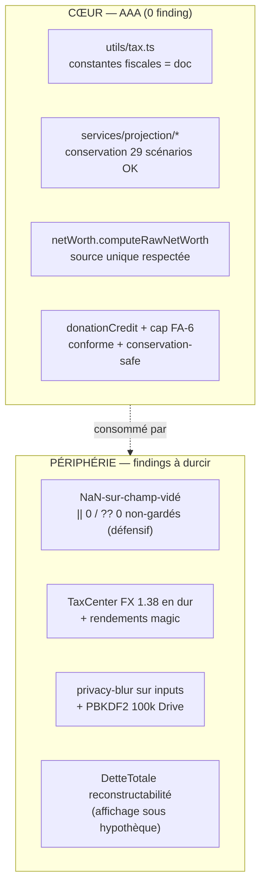

# AUDIT FINANCIER EXHAUSTIF — 2026-06-23

> **Type** : audit récurrent de TOUT le moteur financier sur `main` (PAS un diff). Demande Marc 2026-06-17
> (« lancer régulièrement pour valider et peaufiner »). Commit audité : **`ce61ee1`** (FA-6 inclus).
> **Passe précédente** : `docs/AUDIT_FINANCIER_2026-06-17.md` (verdict : cœur AAA, findings périphériques).
> **Méthode** : panel adversarial 5 agents en parallèle (financial-integrity, projection-validator,
> code-analyzer, silent-failure-hunter, security-privacy), briefés à RÉFUTER ; findings vérifiés (trust-but-verify).

## 1. Verdict global

**Cœur AAA confirmé, élargi à un périmètre plus large qu'en juin.**

- **Fiscalité** : 0 écart code↔`FISCAL_REFERENCE.md`, 0 constante fiscale en dur non sourcée. Nouveau lot **FA-6
  (crédit dons + cap non remboursable) audité conforme**. Garde de fraîcheur verte (0 mois depuis le ré-audit).
- **Conservation** : prouvée EMPIRIQUEMENT sur **29 scénarios** (jeune→retraité insolvable, immo/Smith, meltdown,
  inflation 0-7 %, dons actif/retraité/bas-revenu, locatif/CCPC actif). Arbitre forme-bilan `ΔNW == ΔΣactifs −
  ΔDettesNonImmo` → résiduel max **0,03 $** (poussière d'arrondi). Symétrie per-conjoint parfaite. Suite **2329/2329**.
- **Les findings sont PÉRIPHÉRIQUES** (affichage/UI, hardening défensif, sécurité au repos) — aucun ne casse la
  conservation ni un calcul fiscal du cœur.

**Δ depuis 2026-06-17** : la quasi-totalité des findings de juin sont **FERMÉS** (H1/H2/SEC-1/M2/M3/M4/L1-L4). Restent
ouverts : `FISC-WHT-HARDCODE` (compteur d'affichage), `FISC-WELCOME-2026` (blocage Marc). **Nouveautés ce tour** : un
thème transversal **NaN-sur-champ-vidé** (défense-en-profondeur) + 2 findings sécurité (privacy-blur sur inputs, PBKDF2).

## 2. Diagramme — où vivent les findings (cœur sain, périphérie à durcir)

## 3. Findings vérifiés, par sévérité

### MOYEN

**[NAN-INPUT-HARDENING]** — *thème transversal, défense-en-profondeur.* Sur le chemin $, plusieurs consommateurs
gardent les valeurs avec `|| 0` / `?? 0`, qui **ne rattrapent PAS NaN** (NaN est falsy pour `||` mais `??` ne capte
que null/undefined). Un NaN (champ numérique vidé sans resaisie, prix de marché échoué) se propagerait alors en
silence dans le NW / la projection — et **les 12 invariants de conservation NE l'attrapent PAS** (`NaN > EPS` est
false). ⚠️ **Reachability LIMITÉE vérifiée** : la plupart des inputs sanitisent à la saisie (`parseFloat(x) || 0`
→ 0, jamais NaN au store), donc ce n'est pas un bug ACTIF mais un **durcissement** (leçon HARDEN-NETWORTH-NAN — la
référence est `computeRawNetWorth` : garde `Number.isFinite` sur l'agrégat + `logError` throttlé). Sites :
| `file:line` | Garde manquante | Sévérité réelle |
|---|---|---|
| `services/portfolio.ts:147` | `(d.balance \|\| 0)` — dette NaN → NW gonflé | MOYEN |
| `services/projection/retirementIncome.ts:173` | `psvResidencyYears[idx] ?? 0` — NaN résidence → revenu retraite NaN | MOYEN (le plus propageant) |
| `services/projection/taxDecember.ts:600` | réconciliation sautée si NaN, **sans log** | MOYEN (ajouter `logError`) |
| `utils/useDerivedFinancials.ts:51-61` | FX `\|\| 1`, prix, `initialBalances` non gardés | MOYEN |
| `services/projection/monthlyEvents.ts:160` | `(e.impactAmount ?? 0)` — NaN → dépense/shortfall NaN | MOYEN |
| `services/projection/w5Effects.ts:125,139` | loyer/dividende CCPC NaN → bucket `divers` NaN | MOYEN |
| `services/projection/helpers.ts:57` | `startVal<=0 && endVal<=0` (NaN≤0 = false) → croissance NaN hot-path | MOYEN |
> Fix groupé recommandé : passe de durcissement `Number.isFinite` + `logError` (throttlé en hot-path MC) sur ces 7 sites,
> calquée sur `computeRawNetWorth`. Discriminant : injecter un NaN en amont → le test doit lever (aujourd'hui il passe).

**[TC-FX-HARDCODE]** — `components/TaxCenter.tsx:139` : conversion USD avec **`1.38` en dur** au lieu de `state.fxRates`
(le composant ne reçoit pas `fxRates` en props). L'**impôt estimé affiché** et la suggestion remboursement/dû sont faux
pour un détenteur d'actifs USD. + rendements estimés `0.02`/`0.07` (`:141-142`) en magic numbers. *Même classe que les
findings « UI/IA contourne la source unique » de juin (H2/L4, désormais fermés ailleurs) — TaxCenter avait été manqué.*
Fix : passer `fxRates` (ou `useFinanceStore`) + extraire les rendements en constantes. Effort S.

### MOYEN (sécurité / vie privée)

**[SEC-PRIVACY-BLUR-INPUTS]** — `components/budget/BudgetGroupTable.tsx:180`, `components/retirement/RetirementIncomeCard.tsx:27,73`
utilisent la classe CSS `privacy-blur` (`filter: blur`) sur des `<input>` dont la `value` **reste dans le DOM** (lisible
via inspecteur / copier-coller / lecteur d'écran). Viole la politique CLAUDE.md « jamais un simple blur CSS » (fuite Loi 25).
⚠️ Nuance : ce sont des champs ÉDITABLES → fix = masquer la valeur hors-focus ou désactiver l'input en mode discret (pas
juste `<PrivateAmount>`). Effort S-M.

**[SEC-PBKDF2-DRIVE]** — `services/sync/keyCipher.ts:25` : `PBKDF2_ITERATIONS = 100_000` pour chiffrer les `apiKeys`
poussées au Drive, vs **600 000** pour les backups locaux. Le `sub` Google (matériel de dérivation) est stable/peu
entropique → aligner à 600k durcit le brute-force d'un blob Drive volé (×6). Rétro-compatible (n'affecte que les nouvelles
écritures). Effort XS.

### FAIBLE

- **[M1-FISC-WHT-HARDCODE]** (ouvert depuis juin) — `services/projection.ts:1424` : retenue REER `* 0.15` en dur dans le
  **compteur d'affichage** `totalTaxesPaid` (PAS le NW : la vraie retenue passe par `RRSP_WITHHOLDING_QC` 19/24/29 %).
  L'utilisateur voit une retenue sous-évaluée pour les retraits > 1ʳᵉ tranche. Fix : `withholdingForGrossRRSP(...)` (vérifier
  non-double-compte avec décembre). Effort S. Impact patrimoine = 0.
- **[M5-INV1-EXTEND]** — `tests/services/projection.moneyConservation.test.ts:155` : INV-1 (reconstructabilité) testé SANS
  hypothèque ; INV-9 couvre le cas hypothèque mais INV-1 n'a pas de scénario discriminant sous prêt. Étendre. Effort S.
- **[HIST-NW-NO-DEBT]** — `services/history/reconstructPortfolioHistory.ts:143` : le champ `NetWorth` du PASSÉ = somme des
  placements SANS dettes (≠ futur = actifs − dettes) → historique gonflé pour un endetté. Renommer `InvestedValue` ou
  documenter le scope. Effort XS.
- **[SEC-LOG-DEBT-REGEX]** — `services/errorLogger.ts:72` : `SENSITIVE_KEY_PATTERNS` ancré `^debt$` → `liquidDebt`/`totalDebt`
  non redactés SI un site logge un tel contexte. ⚠️ **Déjà mesuré/assessé** (lesson HARDEN-NETWORTH-NAN : `^debt$` anchored,
  faux positif réfuté) — aucun site de log confirmé n'expose `liquidDebt` → latent/défensif. Élargir le pattern (sans ancres)
  si on veut la ceinture-et-bretelles. Effort XS.
- **[SEC-CSP-STYLE]** `vercel.json` `style-src 'unsafe-inline'` (trade-off Tailwind documenté) ; **[SEC-HSTS-PRELOAD]** HSTS
  sans `preload`. Posture incomplète, impact quasi-nul (local-first chiffré au repos). Effort XS.

### Faux positifs réfutés (CONSERVÉS — documentent pourquoi ce n'est PAS un bug)

- **`FISC-WHT-HARDCODE` n'est PAS un écart fiscal** : `totalTaxesPaid` est un compteur de DIAGNOSTIC (alimente le ratio
  `taxLeakage` MC + le classement de stratégies), jamais un flux qui touche le patrimoine. La vraie retenue passe par la
  source unique `RRSP_WITHHOLDING_QC`. (Reclassé en FAIBLE-affichage ci-dessus.)
- **Proxies locatif `0.45` / CCPC `0.36`** (`w5Effects.ts`) : étiquetés « non sourcé — proxy de modèle, BACKLOG W5-TAX-PROXY ».
  Pas des constantes fiscales prétendues. Conformes « no fake data ».
- **`Math.max(0.1, NaN)` à `realEstateMonth.ts:244`** : inatteignable — `getMarginalRate` a sa propre garde NaN (`tax.ts:707`).
- **NaN findings sur-estimés en sévérité** par l'agent : reachability non vérifiée (les inputs sanitisent majoritairement à 0).
  Reclassés MOYEN-défensif (ci-dessus), pas ÉLEVÉ-actif.

## 4. Limites assumées (inchangées)

- `FISC-WELCOME-2026` : seuils mutation « reste_qc » millésime 2025 (`realEstate.ts:102`) — réindexation 2026 = **blocage Marc**
  (valeurs officielles RQ à sourcer). Impact ~centaines $ sur une transaction.
- `DetteTotale` reconstructabilité sous hypothèque (finding M5 juin) : écart d'AFFICHAGE, pas d'argent fantôme (`DettesNonImmo`
  reconstruit correctement). Périphérique.
- `dangerouslyAllowBrowser` (clé Anthropic visible navigateur) : dette connue, proxy backend à venir.
- Gate Google SOFT (`?nogate=1`) : modèle multi-utilisateurs voulu.

## 5. Scorecard par axe

| Axe | 2026-06-17 | 2026-06-23 | Note |
|---|---|---|---|
| Conformité fiscale | A+ | **A+** | +FA-6 conforme |
| Conservation de l'argent | A+ | **A+** | 29 scénarios, résiduel 0,03 $ |
| Source unique NW (moteur↔UI/IA) | A− | **A** | findings juin fermés ; reste TaxCenter FX |
| Robustesse NaN / échecs silencieux | A− | **B+** | thème NaN-input à durcir (défensif) |
| Sécurité / vie privée au repos | A | **A−** | privacy-blur inputs + PBKDF2 Drive |
| Dette / lisibilité moteur | A− | **A−** | stable |

## 6. Recommandations (lot proposé, plan-first pour le money-critical)

1. **Lot non-money-critical sûr** (PR groupée, faible risque) : `SEC-PBKDF2-DRIVE` (XS), `TC-FX-HARDCODE`+`TC-MAGIC-YIELDS`
   (S), `HIST-NW-NO-DEBT` doc (XS), `SEC-LOG-DEBT-REGEX` élargi (XS). Pas de toucher au moteur de conservation.
2. **`NAN-INPUT-HARDENING`** (passe de durcissement défensif, MOYEN) : `Number.isFinite` + `logError` throttlé sur les 7
   sites, avec test discriminant (injecter NaN → lever). Touche le moteur → plan-first + panel + conservation.
3. **`SEC-PRIVACY-BLUR-INPUTS`** (UI/Loi 25) : masquer la valeur hors-focus des inputs en mode discret. a11y-auditor au gate.
4. **`M1-FISC-WHT-HARDCODE`** + **`M5-INV1-EXTEND`** : petits, money-display/tests, à grouper.
5. **`FISC-WELCOME-2026`** : bloqué — sourcer les seuils 2026 (action Marc).

**Conclusion** : le cœur financier est sain et le reste (vérifié empiriquement). Les findings sont des durcissements et des
corrections d'AFFICHAGE/sécurité périphériques, aucun ne menace l'exactitude des calculs ni la conservation. Recommandé :
attaquer le **lot 1 (sûr)** d'abord, puis `NAN-INPUT-HARDENING` (plan-first) — sans précipiter, le cœur n'est pas en jeu.
