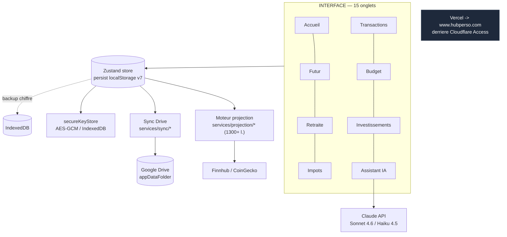
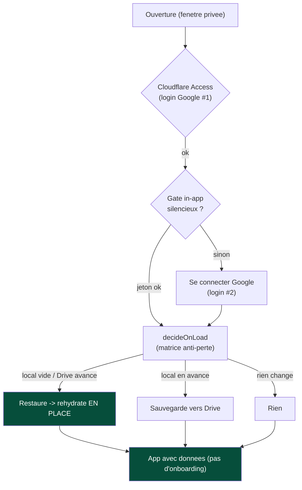
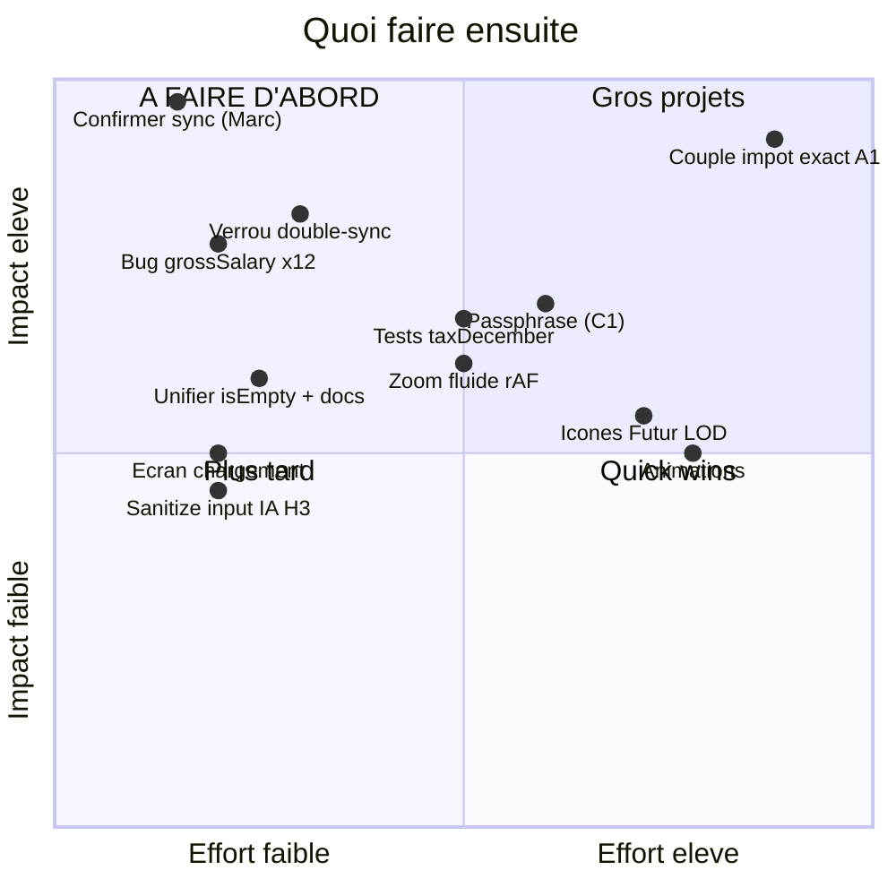

# Snapshot FinanceAI — 2026-05-29

> Photo de l'état de l'app : ce qui marche, la santé du code (audit 4 agents croisés),
> et les prochaines étapes priorisées. Diagrammes Mermaid (rendu natif sur GitHub).

## Verdict en 30 secondes

App **mûre et en production** (732 commits, ~40 000 lignes, 15 onglets, 1261 tests verts,
Lighthouse 97/100/100/90). Le **cœur fonctionne** : budget, transactions, moteur de
projection/retraite, fiscalité QC, IA, import CSV, PWA. Le seul chantier non stabilisé =
la **sync Google Drive** (corrigée en code + prouvée par tests, **pas encore confirmée en
réel sur version fraîche**). Aucune faille critique de fuite entre utilisateurs ;
**2 arbitrages sécu** (clés API en clair dans Drive, token en sessionStorage) et **1 risque
archi** (double-sync sans verrou) identifiés.

---

## 1. Architecture

Local-first, 100 % client (pas de backend). Source de vérité = `localStorage` ;
Drive = sauvegarde cross-device ; IndexedDB = clés chiffrées + backup.

---

## 2. Tableau de bord — ce qui marche / fragile / à faire

Jauge `●●●●●` = solidité (rempli = solide).

| Domaine | État | Solidité | Note |
|---|---|---|---|
| Accueil / Transactions / Budget | OK | ●●●●● | En prod, stable |
| Moteur projection (Futur) | OK | ●●●●○ | Solide en intégration ; edge cases sous-testés en unitaire |
| Retraite / FIRE / Impôts QC 2026 | OK | ●●●●○ | Fiscalité auditée ; `taxDecember.ts` 0 test unitaire |
| Investissements / Import CSV / Crypto | OK | ●●●●● | Banque + courtier CSV, Finnhub, CoinGecko |
| Assistant IA (Claude) | OK | ●●●●○ | Anti-injection en place ; input chat non sanitisé (H3) |
| PWA / offline / install | OK | ●●●●● | SW network-first anti-staleness |
| Couple / individuel | Partiel | ●●●○○ | Fondation B faite ; impôt exact par conjoint (A1) à faire |
| **Sync Google Drive** | **À confirmer** | ●●●○○ | Code corrigé + tests verts, pas validé en réel sur version fraîche |
| Zoom graphes | Fragile | ●●○○○ | Saccadé (pas de rAF) — connu |
| Onboarding vs restauration | Corrigé | ●●●●○ | N'écrase plus profils/clés (fix 2026-05-29) |

---

## 3. La sync Drive (chantier chaud)

**Corrigé cette semaine (6 fixes, CI verte) :** test-mode ne contamine plus Drive · gate
restaure dès que Drive a avancé · plus de 2ᵉ login après reload · restauration en place
sans reload · jeton persistant en session · onboarding n'écrase plus profils/clés.

**Prouvé par :** test d'intégration du flux gate→restore + 1261 tests + smoke navigateur.
**Pas encore confirmé :** test réel sur version fraîche (cache PWA suspecté sur les essais
précédents).

---

## 4. Santé du code — synthèse 4 agents

### 🔐 Sécurité
- **C1 (arbitrage) — clés API en clair dans Drive** (`syncEngine.ts`, `syncTypes.ts`). Le
  champ `apiKeys` part en clair (`enc:false`). Fix correct = **passphrase** (la clé de device
  ne marche pas en multi-appareils). Décision Marc requise.
- **C2 (arbitrage) — token Drive en sessionStorage** (`gisAuth.ts:57-90`). Le retirer =
  sécurité++ mais ré-introduit la reconnexion en navigation privée. Risque réel faible
  (XSS requis, CSP forte, token court scope appdata, derrière Cloudflare). Gardé + documenté.
- **HAUT** : `dangerouslyAllowBrowser` (clé Anthropic dans le header — OK solo), `?nogate`
  bypass (OK tant que Cloudflare actif), input AiAssistant non sanitisé (H3 — à corriger),
  `console.error` hors `logError` (H4).
- **SAIN** : isolation `appDataFolder` (aucune fuite entre comptes), clés chiffrées au repos,
  anti-injection en couches, logger PII-safe, CSP `script-src` sans `unsafe-inline`.

### 🏗️ Archi
- **HAUT** — double exécution sync au boot (gate + `runBootSync` 2,5 s) **sans verrou** →
  risque doublons Drive / double rehydrate. **Fix P0.**
- **HAUT** — commentaires « reload » périmés (c'est `rehydrate`) + divergence
  `computeIsEmpty` (14 tableaux) vs `hasMeaningfulData` (6) → unifier. **Fix P0.**
- **MOYEN** — god-files >800 l. : `projection.ts` (1308), `Investments.tsx` (1120),
  `FutureProjection.tsx` (962), `Budget.tsx` (890), `pdfReport.ts` (847).
- **SAIN** : `syncEngine` pur exemplaire, error handling honnête (`PushResult`), clés hors
  persist, hash payload-seul, mode test jamais synchronisé.

### 🧪 Tests
- **`taxDecember.ts` : 0 test unitaire** (module fiscal le plus dense). Risque max.
- `cashflowAllocation.ts` (cascade shortfall) + `activeIncome.ts` : sous-testés.
- Chemins d'échec sync (token KO, Drive indispo) non testés.
- Piège « réplique » : `personaAudit.test.ts` copie le code au lieu de l'appeler.

### 🎨 Frontend
- **HAUT** — zoom sans rAF (`useTimeChartZoom.ts`) ; `ga-init.js` bloque le parse (manque `defer`).
- **MOYEN** — pastilles d'événement non focusables clavier ; PWA cache-first sur CSV.
- **SAIN** : lazy-load par onglet, Worker Monte-Carlo, `Modal` focus-trap exemplaire,
  tokens WCAG AA, `prefers-reduced-motion`, axe-core en CI.

---

## 5. Prochaines étapes — impact × effort

### Ordre recommandé

| Priorité | Action | Pourquoi |
|---|---|---|
| **P0** | Marc confirme la sync (version fraîche) | Débloque tout |
| P0 | Verrou anti-double-sync | Possible cause des ratés |
| P0 | Unifier `computeIsEmpty`/`hasMeaningfulData` + purger docs « reload » | Cohérence module anti-perte |
| P0 (décision) | C1 passphrase · C2 token : arbitrages à trancher | Sécurité vs UX/multi-appareils |
| **P1** | Bug `grossSalary` annuel→mensuel (3 chemins) | Money-critical |
| P1 | Tests `taxDecember` + cashflow shortfall + erreurs sync | Argent non couvert |
| P1 | Zoom 100 % fluide (rAF) + écran de chargement | Demandes UX |
| P1 | Sanitize input IA (H3) + `ga-init defer` + `console.error`→`logError` (H4) | Sécu/perf rapides |
| **P2** | Couple : impôt exact par conjoint (A1) | Plus gros gain produit |
| P2 | Icônes Futur LOD · Animations · infobulle impôt dormant · refonte god-files | Valeur perçue |

---

*Généré à partir de : BACKLOG.md, CHANGELOG.md, SESSION_HANDOVER.md, git log, et 4 audits
agents (sécurité, archi, tests, frontend) du 2026-05-29.*
